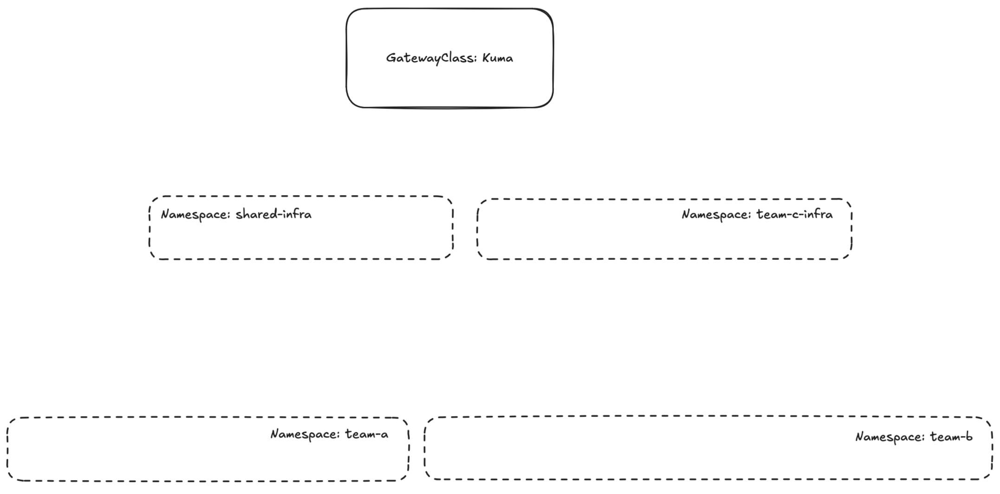
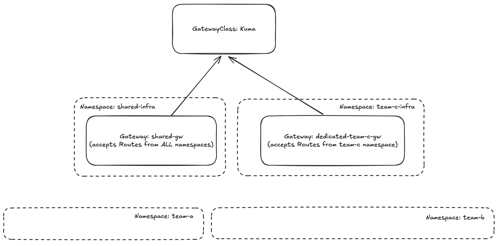
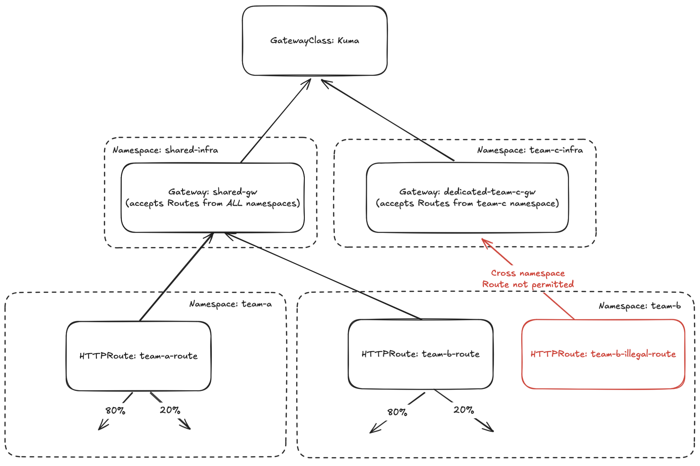
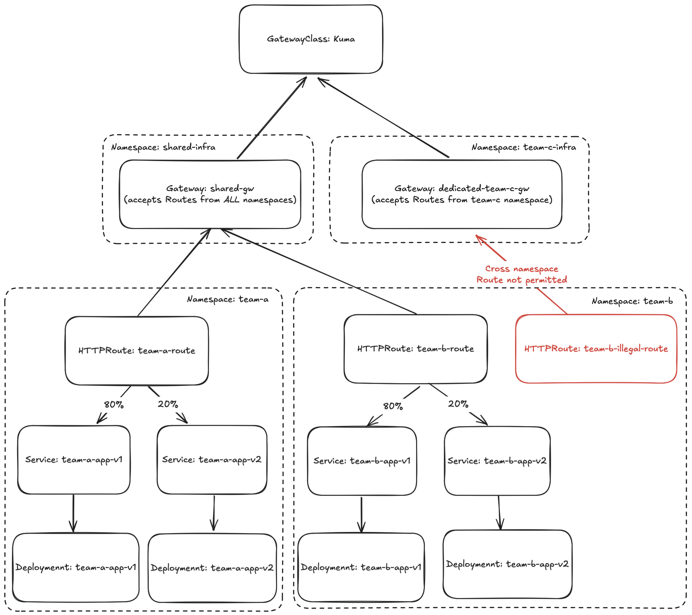

# Gateway API Demo

A short demo exploring some of the ways that Gateway API can be used. 
A companion blog post can be found here: (TODO: add hyperlink to blog)

Over the course of this demo, we'll be creating a local kind cluster that will use Gateway API and the Kuma provider to route traffic to multiple backends.
We'll be exploring some of the features of Gateway API including:
- path based routing
- header modification
- path rewrites
- traffic splitting
- explore ideas around canary traffic rollout via HTTPRoutes

## Prerequisits

To be able to follow along with this demo, you'll need:
- docker
- kind
- cloud-provider-kind
- helm

Ensure you have all the above installed. Once done, we can start setting up our cluster.

## Cluster Setup

Follow the instructions below to create your cluster, install Gateway API CRDs on it, install and configure kuma, and setup required namespaces

```
kind create cluster

kubectl apply -f https://github.com/kubernetes-sigs/gateway-api/releases/download/v1.2.0/standard-install.yaml

helm repo add kuma https://kumahq.github.io/charts
helm repo update
helm install --create-namespace --namespace kuma-system kuma kuma/kuma

kubectl apply -f manifests/1-kuma.yaml
```

Because kind doesn't natively support loadbalancers, we need to install and run cloud-provider-kind in another terminal
```
sudo cloud-provider-kind
```

Once `Kuma` is installed, you can also view the dashboard by running this command in another terminal
```
kubectl port-forward svc/kuma-control-plane -n kuma-system 5681:5681
```

Next open you browser at `http://127.0.0.1:5681/gui`

As of this point, your cluster should look like this:


## Gateway Creation

Now we can create 2 Gateways. One thats shared and allows routes from all namespaces, and another thats dedicated to the `team-c` namespace.
This is an operation that would typically be done by someone acting as a `Cluster Operator`.
```
kubectl apply -f manifests/2-gateways.yaml
```

Now we can get the loadbalancer IP for our Gateway (assuming you've started running `cloud-provider-kind` another terminal already)
```
export PROXY_IP=$(kubectl get svc --namespace shared-infra shared-gw -o jsonpath='{.status.loadBalancer.ingress[0].ip}')
echo $PROXY_IP
```

You can now test connecting to the gateway by running
```
curl -v ${PROXY_IP}:80
This is a Kuma MeshGateway. No routes match this MeshGateway!
```

As the output above suggests, its time to add some routes.

Our cluster now looks something like this:


## Create Routes

Now that we have a shared `Gateway`, routes can be attached by individuals or teams from any namespace. This is something that is typically left to users with the `Application Developer` persona.
We can deploy our preconfigured routes by running:
```
kubectl apply -f manifests/3-routes.yaml
```

This applies routes that do the following
1. use path based routing to send requests to the right destination 
2. add an extra header on each request (X-Request-From: "Gateway-API-Demo")
3. rewrite paths `/team-a` and `/team-b` to `/api`
4. split traffic based on weight (80% to v1 of the backend and 20% to v2 of the backend. Later we can update the weights on the backends to continue the canary traffic rollout)

We can also try attaching a route from namespace `team-a` namespace to the `team-c` dedicated gateway
```
kubectl apply -f manifests/3-routes-failed.yaml
```

Once this resource is applied, you'll notice the following status on it proving that it wasn't attached to the gateway.
```
status:
  parents:
  - conditions:
    - lastTransitionTime: "2025-01-09T21:13:27Z"
      message: hostnames matched parent hostname "", but namespace "team-a" is not
        allowed by the parent
      observedGeneration: 1
      reason: NotAllowedByListeners
      status: "False"
      type: Accepted
```

As things start coming together, our cluster now has this configuration:


## Deploying the Backends

Next in the process is setting up the servers that will recieve the traffic dictated by the Routes we previously configured.
This server has a single `/api` endpoint that does the following:
- logs a `Hello from <APP_NAME>` message to indicate to us exactly which server handled the request
- logs a `Received from <Header: X-Request-From>` message to prove that we were able to add the `X-Request-From` header using the HTTPRoute
- returns a 200 OK

First we need to build an image of our server and load it into your kind cluster. This image will be used in our upcoming deployments.
```
docker build -t gateway-api-demo-server:latest .
kind load docker-image gateway-api-demo-server:latest
```

Next apply the deployment and service manifests in each namespace
```
kubectl apply -f manifests/4-apps.yaml
```

And now we've finally reached the end state of our cluster:


Assuming you've already running `cloud-provider-kind`, you can hit the 2 configured Routeslike this:
```
curl -i ${PROXY_IP}:80/team-a
HTTP/1.1 200 OK
date: Sat, 11 Jan 2025 03:43:44 GMT
content-length: 57
content-type: text/plain; charset=utf-8
x-envoy-upstream-service-time: 1
vary: Accept-Encoding
server: Kuma Gateway

Hello from team-a-app-v1
Received from: Gateway-API-Demo

curl -i ${PROXY_IP}:80/team-a
HTTP/1.1 200 OK
date: Sat, 11 Jan 2025 03:46:25 GMT
content-length: 57
content-type: text/plain; charset=utf-8
x-envoy-upstream-service-time: 7
vary: Accept-Encoding
server: Kuma Gateway

Hello from team-a-app-v2
Received from: Gateway-API-Demo
```

Notice that the above request may come from `team-a-app-v1` or `team-a-app-v2`. You can make the same request for team-b by running `curl -i ${PROXY_IP}:80/team-b`.
It's also good to take note of the fact that we're making requests to the paths `/team-a` and `/team-b` but the backend only handles requests with the path prefix `/api`.
